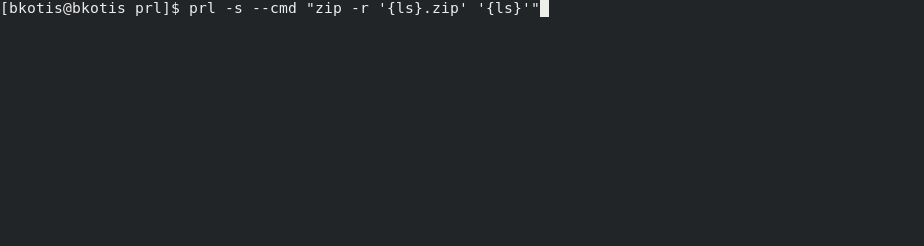

# prl -> Easy sh command parallelization



## Examples

#### Zip all files in current directory
```
prl --cmd "zip -r '{ls .}.zip' '{ls .}'"
```

#### Just print the generated commands, without execution
```
prl --dry-run --cmd "zip -r '{ls .}.zip' '{ls .}'"
```

#### Execute commands, but don't print text returned by commands to stdout(but still show progress bar)
```
prl -s --cmd "zip -r '{ls .}.zip' '{ls .}'"
```

#### Same as above, but set custom text for progress bar
```
prl -s --progbar-string "Zipping files.." --cmd "zip -r '{ls .}.zip' '{ls .}'"
```

#### Get file sizes for all zipped pdf files in the Downloads folder, using 6 parallel processes
```
prl -j 6 --cmd "du -h '{ ls ~/Downloads/*.zip | grep pdf }'"
# don't forget the the two quotes(') around the command - that way spaces etc in filenames are correctly handled
```
#### Get list of active hosts in IP range using ping, using 12 processes, into a file(hosts.txt)
```
prl -j 12 --cmd "ping -c 1 192.168.0.{seq 0 100} && echo 192.168.0.{seq 0 100} UP >> hosts.txt || echo 192.168.0.{seq 0 100} DOWN >> hosts.txt"
```

## Arguments


- -j -> The number of concurrent processes to execute the command over
- --cmd -> A string of the command to execute. 
- --progbar-string -> Set custom text for your progress bar
- -s -> Silent mode, don't print text returned from commands to stdout(but still show progbar)
- --dry-run -> Print out generated commands to be executed, but don't actually execute them
- --help -> Print help msg

The command string should have commands to parallelize over in parantheses -> {}
The results of this command should result in a list of arguments, separated by newline(\n)
prl will execute the supplied command in parallel, substituting the arguments into the place of the parantheses

## Simple example

```
prl -j 2 -cmd "ls '{ls /home}'"
```
Where /home contains:
```
/home/user1
/home/user2
```
The commands executed concurrently will be:
```
ls '/home/user1'
ls '/home/user2'
```
But this can be used for any shell command.

## TODO
- Better logging, where all the output is captured and sorted by command
- Many, many more tests
